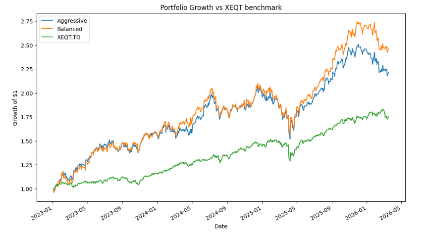

# Portfolio Analysis Tool

A Python-based tool for analyzing asset performance, constructing portfolios, and comparing them against benchmarks like XEQT.

This project uses real market data to compute returns, risk metrics, and visualize portfolio growth over time.

---

## Features

- Download historical price data using `yfinance`
- Compute asset-level metrics:
  - Annualized return
  - Volatility
  - Sharpe ratio
  - Drawdowns
- Construct custom portfolios using weighted allocations
- Compare multiple portfolios side-by-side
- Benchmark portfolios against ETFs (e.g., XEQT)
- Visualize growth of $1 over time

---

## Example Output

Portfolio growth comparison against XEQT benchmark:

---
## Project Structure

portfolio-analysis-tool/
│
├── data/
│   └── raw/
│       └── prices.csv
│
├── notebooks/
│   └── 01_exploratory_analysis.ipynb
│
├── src/
│   ├── config.py
│   ├── data_load.py
│   ├── features.py
│   └── portfolio.py
│
├── requirements.txt
└── README.md

---

## Example Portfolio

Example portfolio allocation used in testing:

- AAPL 30%
- MSFT 30%
- GOOGL 20%
- AMZN 10%
- TSLA 10%

The portfolio return series is computed as the weighted sum of individual asset returns.

Portfolio growth is then obtained through cumulative compounding of the return series.
---

## Technologies Used

- Python
- pandas
- numpy
- matplotlib
- yfinance

---

## AI Assistance

Some code structure, debugging guidance, and design suggestions were developed with the assistance of AI tools. All code was reviewed, implemented, and tested manually as part of the learning process.